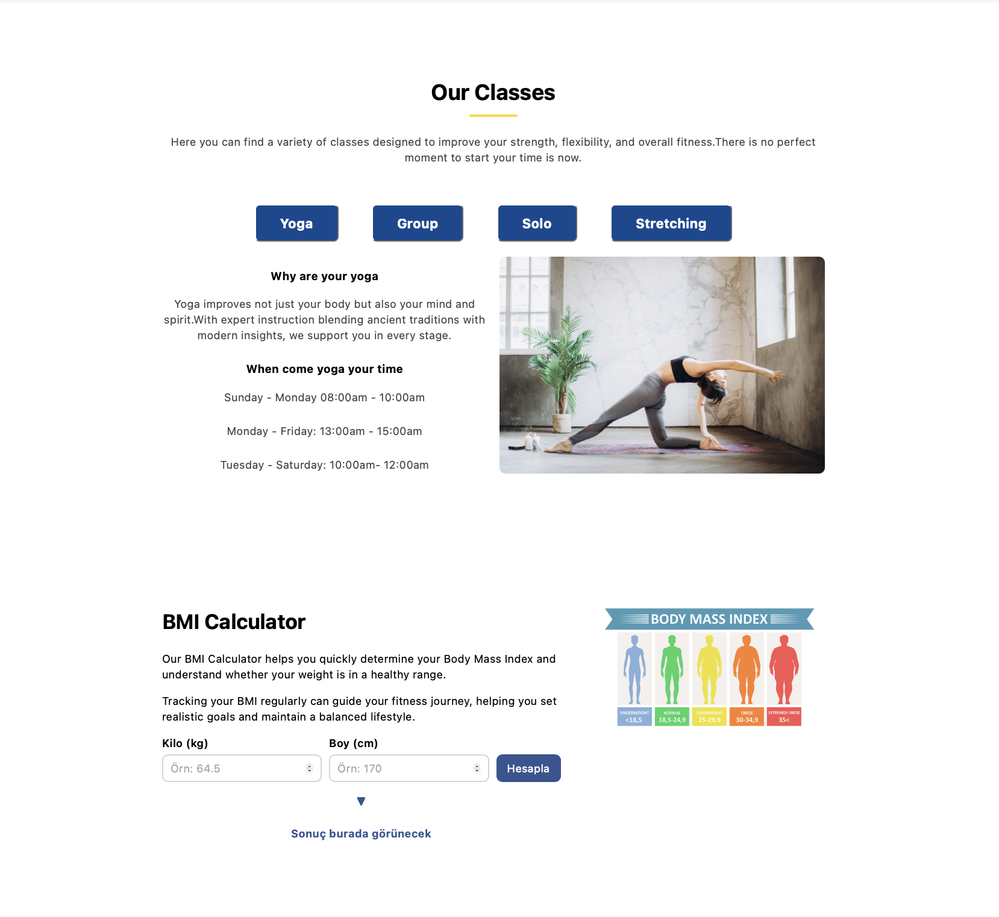
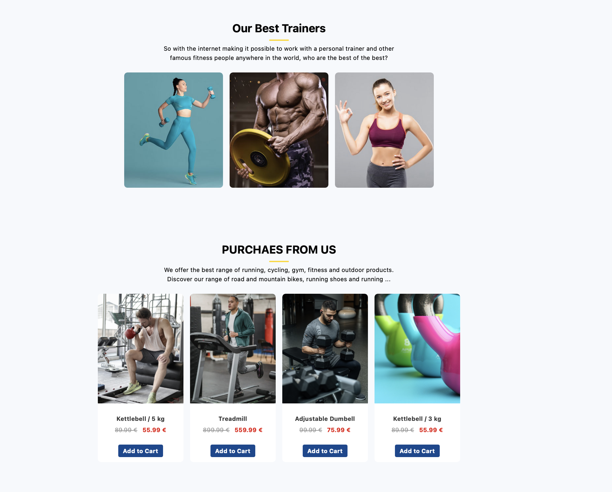
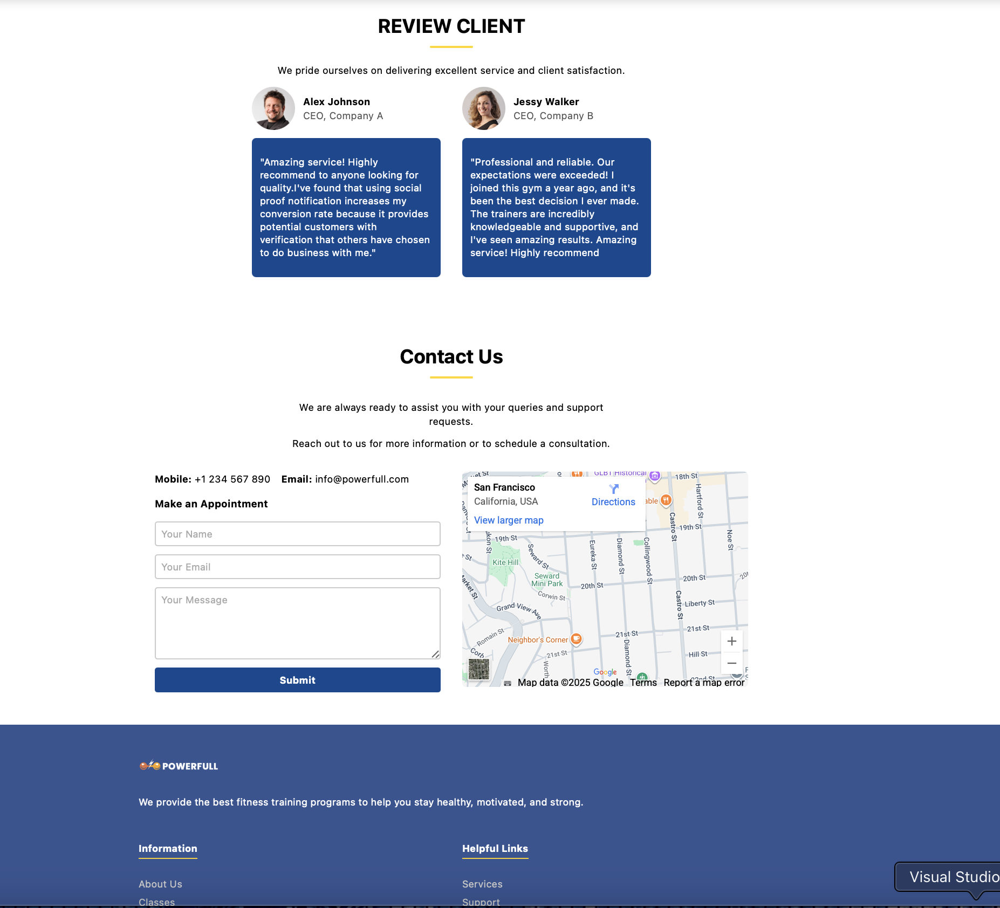

# Sport Center

Bu proje, modern bir spor merkezi web sitesi tasarımıdır. Kullanıcı dostu arayüzü ve responsive (mobil uyumlu) yapısıyla, spor merkezi hakkında bilgi almak isteyen ziyaretçilere kolaylık sağlar.

##  Live Demo
Proje Netlify üzerinden canlıya alınmıştır:  
 [Sport Center Live Site](https://effortless-treacle-744169.netlify.app)

##  Özellikler
- Responsive tasarım (mobil, tablet ve masaüstü uyumlu)  
- Hero bölümünde dikkat çekici görsel  
- Hakkımızda, dersler ve eğitmenler bölümleri  
- Modern ve sade kullanıcı arayüzü  

##  Kullanılan Teknolojiler
- **HTML5**  
- **CSS3**  
- **Bootstrap 5**  

## ⚙ Kurulum & Çalıştırma
Projeyi kendi bilgisayarında çalıştırmak için:  

1. Bu repoyu klonla:  
   ```bash
   git clone https://github.com/fnuryigit/Sport_Center.git

...

## Görseller







